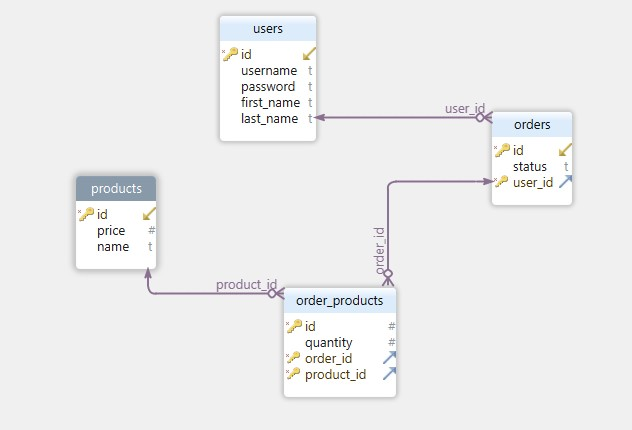

# API Requirements

The company stakeholders want to create an online storefront to showcase their great product ideas. Users need to be able to browse an index of all products, see the specifics of a single product, and add products to an order that they can view in a cart page. You have been tasked with building the API that will support this application, and your coworker is building the frontend.

These are the notes from a meeting with the frontend developer that describe what endpoints the API needs to supply, as well as data shapes the frontend and backend have agreed meet the requirements of the application.

## API Endpoints

#### Products

- Index
- Show
- Create [token required]
- [OPTIONAL] Top 5 most popular products
- [OPTIONAL] Products by category (args: product category)

#### Users

- Index [token required]
- Show [token required]
- Create N[token required]

#### Orders

- Current Order by user (args: user id)[token required]
- [OPTIONAL] Completed Orders by user (args: user id)[token required]

## Data Shapes

#### Product

- id
- name
- price
- [OPTIONAL] category

#### User

- id
- firstName
- lastName
- password

#### Orders

- id
- id of each product in the order
- quantity of each product in the order
- user_id
- status of order (active or complete)

## API Endpoints:

### Users

- `GET  - /api/users/` get all users (token Required)
- `POST - /api/users/` create a user
- `GET  - /api/users/:id` get a user (token Required)

### products

- `GET  - /api/products/` get all products
- `POST - /api/products/` get all products (token Required)
- `GET  - /api/products/:id` get all one Product
- `GET  - /api/products/category/:category` get all products in the category
- `GET  - /api/products/popular` get Most popular products

### orders

- `GET  - /api/orders/` get all product on the active order (token Required)
- `POST - /api/orders/` add product to the order (token Required)
- `GET  - /api/orders/complete` get all completed orders (token Required)
- `PATCH- /api/orders/complete` update order status (token Required)
- `GET  - /api/orders/active` get current active order (token Required)

## Database sehcma

## Data shapses

- users

  - id : `Primary Key`
  - username : `Varchar Uniqe`
  - first_name: `varchar`
  - last_name: `varchar`

- products

  - id : `Primary Key`
  - name : `varchar`
  - price : `integer`

- orders

  - id : `Primary Key`
  - status : `Enum of ('ACTIVE' | 'COMPLETE')`
  - user_id : `forign key to users table`

- order_porudcts
  - id : `Primary Key`
  - product_id: `forign key to product table`
  - order_id : `forign key to order table`
